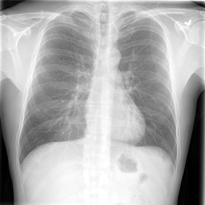
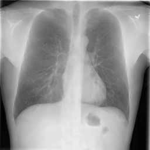
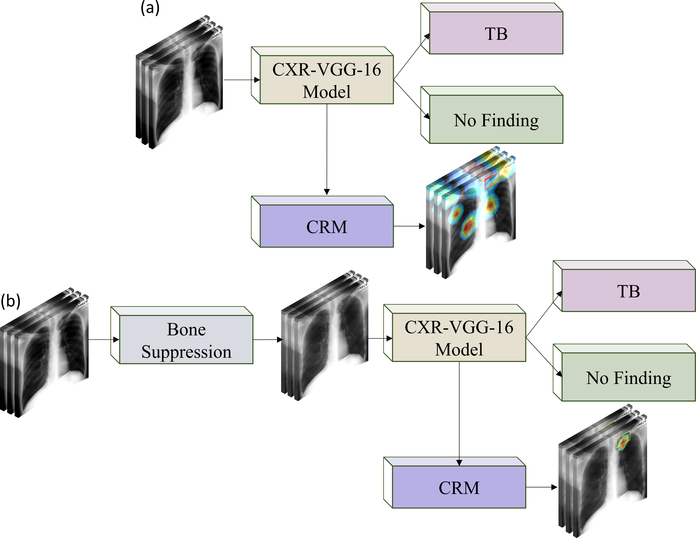
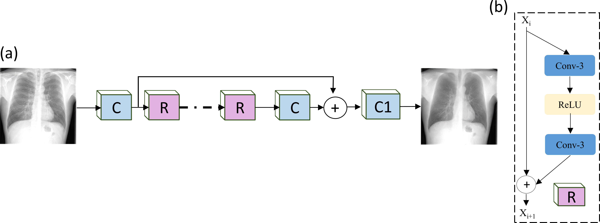

# Chest X-ray bone suppression toward improving classification and detection of Tuberculosis-consistent findings

Chest X-rays (CXRs) are the most commonly performed diagnostic examination to detect lung-related abnormalities and other complications related to these conditions. However, its use to detect subtle abnormalities is constrained by the presence of bony structures including the ribs and clavicles that obscure these abnormalities and render them undetected. This study aims to build deep learning (DL)-based bone-suppression model that identifies and removes the superimposing bony structures in CXRs to facilitate reducing errors in radiological interpretation related to detecting Tuberculosis (TB)-consistent findings.

Original image             |  Bone-suppressed image
:-------------------------:|:-------------------------:
  |  

We propose a stagewise, systematic methodology in this study: First, we retrain an ImageNet-trained VGG-16 model on a large-scale, diverse, combined selection of publicly available CXRs to help it learn CXR modality-specific features. The learned knowledge is transferred to improve performance in a related target classification task of classifying CXRs in the publicly available Shenzhen and Montgomery TB collections as showing normal lungs or pulmonary TB manifestations. Next, we train several bone-suppression models with varying architecture on the Japanese Society of Radiological Technology (JSRT) CXR dataset and its bone-suppressed counterpart. The performance of the trained models is tested using the cross-institutional National Institutes of Health (NIH) clinical center (CC) dual-energy subtraction (DES) CXR dataset. The best-performing model is used to suppress bones in the Shenzhen and Montgomery TB collections. We then compare the performance of the CXR-retrained VGG-16 models trained with the non-bone-suppressed and bone-suppressed Montgomery TB datasets using several performance metrics and analyzed them for a statistically significant difference. The predictions of the non-bone-suppressed and bone-suppressed models are interpreted through class-selective relevance maps (CRM).

Compared to other proposed bone-suppression models, the ResNet-BS model demonstrated superior performance with the least combined loss and higher values for peak signal-to-noise ratio, structural similarity index measure (SSIM), and multi-scale structural similarity index measure (MS-SSIM) metrics. 

For the classification task, we observed that the bone-suppressed models demonstrated superior values for all performance metrics using the Shenzhen and Montgomery TB datasets. The detection of TB-consistent findings in CXRs improved using the bone-suppressed images, signifying that bone suppression improved the sensitivity of the models toward TB detection and localization.

An important contribution of this study is that the models proposed are not limited to bone suppression toward improving TB detection but can potentially be extended to other applications such as improving performance in detecting lung nodules, pneumonia, and COVID-19. With recent advancements in cloud technology, the trained models could be deployed in the cloud for public use and can be implemented in mobile devices.

## What is included?
The Jupyter notebook containing all codes to reproduce this study. It contains:

(i) Steps to train CXR-modality-specific models

(ii) Fine-tune the CXR-modality-specific model for the TB detection task

(iii) Visualize t-SNE embedding with the fine-tuned model

(iv) Generate CRM visualizations with the fine-tuned model

(v) Train bone-suppression models on the original and bone suppressed counterparts

(vi) Predict bone-suppressed Montgomery CXRs using the trained model.

We have also included the best-performing ResNet-BS bone suppression model for direct use. Run the model on 256 x 256 grayscale CXR image to geneate a soft-tissue image with suppressed bone shadows. 

